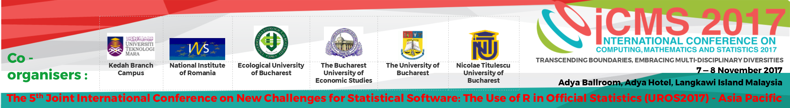

---

---

<link rel="stylesheet" href="styles.css" type="text/css">

 

THE 3rd INTERNATIONAL CONFERENCE ON COMPUTING, MATHEMATICS AND STATISTICS 2017 (iCMS2017)  
&  
THE 5th JOINT INTERNATIONAL CONFERENCE ON NEW CHALLENGES FOR STATISTICAL SOFTWARE: THE USE OF R IN OFFICIAL STATISTICS (UROS2017) - ASIA PACIFIC  

Date:  
7 - 8 November 2017

Venue:  
Adya Ballroom, Adya Hotel, Langkawi Island, Malaysia

Theme:  
Transcending Boundaries, Embracing Multi-disciplinary Diversities  

  

## About  
### iCMS2017
The conference was originally one of the flagship conferences under the previously known International Conference of Art, Science and Technology which had been successfully organized in 2010 and 2012. Building on the success of these two conferences, the organizers decided to hold a more focused conference. Now running for the 3rd time, iCMS2017 is a catalyst for researchers to present their ideas that will bring the three different fields of computer science, mathematics and statistics together and bridge the gap by giving them the opportunity to gain insights into new areas and new perspectives to their respective fields.
 
### UROS2017 – Asia Pacific  
The conference provides a platform for a public forum for researchers from academia and industries to present, exchange ideas and discuss developments in state-of-the-art statistical software commonly used in research. The most focused debates are expected to be the use of R in official Statistics.  

## Co-organisers:  
Kedah Branch Campus  
National Institute of Statistics, Romania  
Ecological University of Bucharest  
The Bucharest University of Economic Studies  
The University of Bucharest  
NicolaeTitulescu University of Bucharest  

