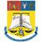
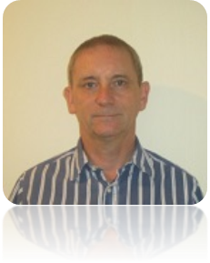

<link rel="stylesheet" href="styles.css" type="text/css">

## Home  

 

THE 3rd INTERNATIONAL CONFERENCE ON COMPUTING, MATHEMATICS AND STATISTICS 2017 (iCMS2017)  
&  
THE 5th JOINT INTERNATIONAL CONFERENCE ON NEW CHALLENGES FOR STATISTICAL SOFTWARE: THE USE OF R IN OFFICIAL STATISTICS (UROS2017) - ASIA PACIFIC  

Date:  
7 - 8 November 2017

Venue:  
Adya Ballroom, Adya Hotel, Langkawi Island, Malaysia

Theme:  
Transcending Boundaries, Embracing Multi-disciplinary Diversities  

  

   

## About 
### Call for Papers
The Faculty of Computer and Mathematical Sciences of Universiti Teknologi MARA Kedah is hosting two parallel international conferences – the *3rd International Conference on Computing, Mathematics and Statistics 2017 (iCMS2017)* and the *5th Joint International Conference on New Challenges for Statistical Software: The Use of R in Official Statistics (UROS2017) – Asia Pacific*. The organizing committee invites academicians, researchers, PhD candidates and practitioners worldwide to submit full papers to the conferences. Participants are entitled to attend both conferences.

### iCMS2017
The conference was originally one of the flagship conferences under the previously known International Conference of Art, Science and Technology which had been successfully organized in 2010 and 2012. Building on the success of these two conferences, the organizers decided to hold a more focused conference. Now running for the 3rd time, iCMS2017 is a catalyst for researchers to present their ideas that will bring the three different fields of computer science, mathematics and statistics together and bridge the gap by giving them the opportunity to gain insights into new areas and new perspectives to their respective fields.
 
### UROS2017 – Asia Pacific  
The conference provides a platform for a public forum for researchers from academia and industries to present, exchange ideas and discuss developments in state-of-the-art statistical software commonly used in research. The most focused debates are expected to be the use of R in official Statistics.  
  
  
### Co-organisers:  
 | | | |  | 
:--:|:--:|:--:|:--:|:--:|:--:
Kedah Branch Campus | National Institute of Statistics, Romania | Ecological University of Bucharest | The Bucharest University of Economic Studies | The University of Bucharest | NicolaeTitulescu University of Bucharest  
\newlines  
  
  

## Speakers  

### Matthias Templ, PhD
| Matthias Templ, PhD |                                                                  |  
|:-------------------:|:-----------------------------------------------------------------|  
|| Dr Matthias Templ is the owner of data analysis company OG. He obtained his PhD in Technical Mathematics from Vienna University of Technology and was an associate professor at the same university. Currently Dr Temple lectures at the Institute of Data Analysis and Process Design, Zurich University of Applied Sciences, Switzerland. He also holds a position as a consultant to the Palacký University Olomouc, Czech Republic. Dr Templ is a researcher at the Quality and Methods Unit at Statistics Austria. His other consultation works include for the World Bank and the OECD. His main research interest is in the area of imputation, statistical disclosure control, visualization, compositional data analysis, computational statistics, teaching in statistics and cluster analysis. He participated in many European research projects, to name one of those: the AMELI project for adequate estimation of poverty and social exclusion. Dr Templ has more than 280 scientific contributions in books, scientific journals and conferences as well as more than 40 papers in well-known indexed scientific journals.  He is the author and maintainer of several R packages for official statistics, such as the `sdcMicro` package for statistical disclosure control, the `VIM` package for visualization and imputation of missing values, the `simPop` package for synthetic population simulation, and the `robCompositions` package for robust analysis of compositional data. He is also a co-author to many other packages.  In addition, Dr. Matthias Templ is the editor-in-chief of the Austrian Journal of Statistics; associate editor for Springer’s Journal Wirtschafts-und Sozialstatistische Archiv; editor for the journal The Register; and on the editorial board of three other journals – JWARP journal, The Journal Transactions on Data Privacy, and the Journal Frontiers in Biomedical Physics |  
  
### Professor Dr. Nicolaas Jan Dirk Nagelkerke  
| Professor Dr. Nicolaas Jan Dirk Nagelkerke |                                                                  |  
|:-------------------:|:-----------------------------------------------------------------| 
|  | Professor Nagelkerke obtained his PhD in biostatistics from the University of Amsterdam. The Nagelkerke *$R^2$* coefficient of determination adopted by SAS and SPSS statistical packages in their logistic regression tools is attributed to Professor Nagelkerke’s work published in Biometrika. He has over 400 publications, mostly in international peer reviewed journals. Professor Nagelkerke is a biostatistician, an epidemiologist and a mathematical modeller with experience in teaching and research and statistical consultancy works in health related industry in Europe, Canada, Africa, Middle East and South East Asia. He has extensive experience in infectious diseases and epidemiological research and modelling, notably TB and HIV/AIDS. His collaboration works included with the Centre for Global Health Research (University of Toronto); WHO in West Africa (burden of disease of tuberculosis), and UNAIDS (mathematical modelling on HIV epidemics). He also did consultancies for the World Bank on mathematical modelling on the impact of antiretroviral therapy in India and on modelling the effects of DOTS(+) on TB control in the Russian Federation. He was attached, to name a few, with the Malawi-Liverpool Welcome Trust, Malawi; Institute of Public Health, United Arab Emirates University; Eramus Medical Center, Rotterdam; Medical Statistics Department of Leiden University; Royal Netherlands Tuberculosis Association; Netherlands National Institute of Public Health and the Environment; Nairobi University; Manitoba University and taught at the Cho Ray Hospital HCM City, Vietnam. |   
  
### Professor Dr Martin Everett  
| Professor Dr. martin Everett |                                                                  |  
|:-------------------:|:-----------------------------------------------------------------|
|  | Professor Martin Everett joined University of Manchester in 2009 having previously worked at East London, Westminster and Greenwich universities. He has helped cofound the Mitchell Centre for Social Network Analysis which evolved from the existing Manchester Social Networks Group. He is a past president of the International Network for Social Network Analysis (INSNA) and a Simmel award holder (the highest award given by the organization). He was elected an academician of the Academy of Social Sciences in 2004. Professor Everett co-author with Steve Borgatti in the development of the software package UCINET, the world’s most commonly used software for analyzing social network data. He has been consulted extensively on the use of networks with government agencies as well as public and private companies. He has co-authored two books and published over 80 journal articles. Professor Everett is also the co-editor of the journal Social Networks. The Impact Factor of the journal is 2.784 with 5-Year Impact Factor of 4.113, and SCImago Journal Rank (SJR) of 2.070. |  
  
   
  
## Pubication Opportunities 

1.	All accepted full papers of both conferences will be published in the Springer conference proceedings and will be indexed in ISI upon approval. Previous conference proceedings (iCMS2015) can be accessed via [iCMS2015](http://link.springer.com/book/10.1007%2F978-981-10-2772-7)  

2.	Authors of selected papers are invited to submit extended version of their full papers to:
    a.	[Austrian Journal of Statistics]( http://www.ajs.or.at/index.php/ajs)  
    b.	[Romanian Statistical Review]( http://www.revistadestatistica.ro/ )  
    c.	[Australian & New Zealand Journal of Statistics](http://onlinelibrary.wiley.com/journal/10.1111/(ISSN)1467-842X )  
    d.	[Journal of Creative Practices of Language Learning and Teaching](https://kedah.uitm.edu.my/CPLT/ )  

    Papers submitted to the above indexed journals might incur an extra minimal publication charge subjected to the requirement of the journal. 
    
   

## Pre-Conference Workshops  

In conjunction with the two conferences, the organising committee is conducting three parallel pre-conference workshops. For registration and further information please refer to the respective link given below.  

### Workshop 1  
**R and Data Manipulation: Big Data Application, 5-6 Nov 2017, Adya Hotel, Langkawi**  

Speaker:  **Matthias Templ, PhD**  

**WHAT IS R?**  
open source; powerful and comprehensive platform for visualizing data, understanding and evaluating statistical models; programming language and software environment for statistical computing and graphics; ready to use for applications in data science, data analytics and for big data sets; participants expected to be able to use efficient R code and use R packages to perform data analytics after the workshop  

**WHO SHOULD ATTEND?**  
Lecturers, Researchers, Engineers, Students, Industry Professionals and Scientists of any discipline who wish to explore R and Big Data.  
  
**COURSE OUTLINE**  
1. vectorized computations  
2. efficient and fast data manipulation with dplyr (and optionally data.table)  
3. how to make your computations faster. A very basic introduction to profiling, Rcpp and parallel computing  
4. some comments and issues when working with big data sets  
5. data visualization using ggplot2  

  
### Workshop 2  
**Modelling Communicable Disease Dynamics and Control, 5-6 Nov 2017, Adya Hotel, Langkawi**  

Speakers: **Professor Nicolaas J D Nagelkerke, Associate Prof. Dr. Sanjay Rampal, Dr Nurhuda Ismail**  

**ABOUT**  
This workshop is an introductory training to address the importance of mathematical modelling as an integrated field of infectious disease epidemiology and mathematical epidemiology as well as its applications to related diseases.  

**WORKSHOP OBJECTIVES:**  
To introduce infectious disease epidemiology and its relation to the applications of mathematical modeling; To introduce the mathematical approach to the development of disease models; To discuss the latest development in the application of disease modeling with case studies and appraisal of literature.  
  
**WORKSHOP CONTENT:**  
Introduction to Communicable Diseases & Epidemiology; Basic Concepts in Disease Modelling; Introduction to Mathematical Modelling Software; Understanding Research Question: Potential Impact of Isoniazid as Early Therapy for Tuberculosis Prevention in Malaysia; Model Parameters and Optimization; Developing the Model Frame; Preparation for Poster Presentation; Final Perspectives on Modelling  
  
**WHO SHOULD ATTEND?**  
Highly recommended to public health and pharmaceutical-industry professionals, policy makers, program managers, infectious disease researchers; medical Statisticians; individual interested in infectious disease; mathematicians who wish to learn key biological concepts and how they are translated into modelling.  
  
  
### Workshop 3  
**Introduction to Social Network Analysis Using UCINET and Netdraw, 5-6 Nov 2017, PARK AVENUE Hotel, Sungai Petani**  

Speakers: **Professor Martin Everett**

**What is Social Network Analysis (SNA)?**  
A theoretical construct useful in the social sciences to study relationships between individuals, groups, organizations, or even entire societies. Network analytics are useful to a broad range of research enterprises. These fields of study include, but are not limited to anthropology, biology, communication studies, economics, geography, information science, organizational studies, social psychology, sociology, and sociolinguistics.  

**Course objectives**  
The course will: 1) Introduce the idea of Social Network Analysis; 2) Explain how to describe and visualize networks using specialist software (UCINET); 3) Explain key concepts of Social Network Analysis (e.g. Cohesion, Brokerage);4) Provide hands-on training to use software to investigate social network structure.  
  
 

## Committee  
  
### International Scientific Committee  
  
SC Members|Institution
--|-------
Tudorel Andrei|National Institute of Statistics and Bucharest, University of Economic Studies, Bucharest, Romania  
Matthias Templ|Statistics Austria and Institute of Data Analysis and Process Design, Zurich University of Applied Sciences, Zurich Switzerland  
Ralf Munnich|University of Trier, Germany  
Risto Lehtonen|University of Helsinki, Finland  
Gergely Daroczi|Easystats Ltd, Budapest, Hungary  
Lucian Liviu Albu|Romanian Academy, Institute for Economic Forecasting, Bucharest, Romania  
Gheorghe Zaman|Romanian Academy, Institute of National Economy, Bucharest, Romania  
Valentina Vasile|Romanian Academy, Institute of National Economy, Bucharest, Romania  
Dorin Jula|Romanian Academy, Institute for Economic Forecasting and Ecological University of Bucharest, Romania  
Bogdan Oancea|University of Bucharest and National Institute of Statistics, Bucharest, Romania  
Monica Roman|Bucharest University of Economic Studies, Romania  
Nicoleta Caragea|National Institute of Statistics and Ecological University of Bucharest, Romania  
Antoniade-Ciprian Alexandru|Ecological University of Bucharest, Romania  
Adrian Dusa|University of Bucharest, Romania  
Elena Druica|University of Bucharest, Romania  
Nicolae-Marius Jula|Nicolae Titulescu University, Bucharest, Romania  
Ana Maria Dobre|National Institute of Statistics  
Gerald Cheang|University of South Australia, Australia  
Suhaidi Hassan|InterNetWorks Research Laboratory, Universiti Utara Malaysia, Malaysia  
Martin Everett|University of Manchester, UK  
Nicolaas Jan Dirk Nagelkerke|University of Amsterdam, Netherland  
Ang Miin Huey|Uiniversiti Sains Malaysia, Malaysia  
Poo Kuan Hoong|Senior Manager Data Science, AC Nielsen  
Nurhuda Ismail|Universiti Teknologi MARA, Malaysia  
  
  
### Organizing Committee (Universiti Teknologi MARA Kedah)  
  
Abd Razak Ahmad  
Asmahani Nayan  
Fazillah Bosli  
Illiasaak Ahmad   
Kamarul Ariffin Mansor  
Kor Liew Kee  
Noor Hafizah Zainal Aznam  
Rosidah Ahmad  
Shahida Farhan Zakaria  
Siti Fairus Mokhtar   	
Siti Nurbaya Ismail  	
Suhardi Hamid  
Wan Siti Esah Che Hussain  
Wan Zulkipli Wan Salleh  
  
 
  
## Contact Us  

E-mail:	
    icms2017@icmskdh.net  
    
Phone	:	
    +604-456 2506 (Assoc. Prof. Dr Kor Liew Kee)  
    +604-456 2406 (Ms Ashmahani Nayan)  
    
Address:  
    Secretariat iCMS2017  
    Faculty of Computer & Mathematical Sciences  
    Universiti Teknologi MARA Kedah Branch,  
    Sungai Petani Campus  
    08400 Merbok  
    KEDAH, MALAYSIA

   

## Disclaimer  

1.  All information submitted for the purpose of registration to the conference and fee payment will be treated with strict confidential.  

2.	UiTM and the organizing committee shall not be able to accept refund requests.  

3.	UiTM and the organizing committee shall not be responsible for information provided in this site on accommodation and tourism in Langkawi Malaysia. Kindly please check linked sites for regular updates.  

4.	All responsibilities on flights and accommodation bookings lie with the delegates. 
